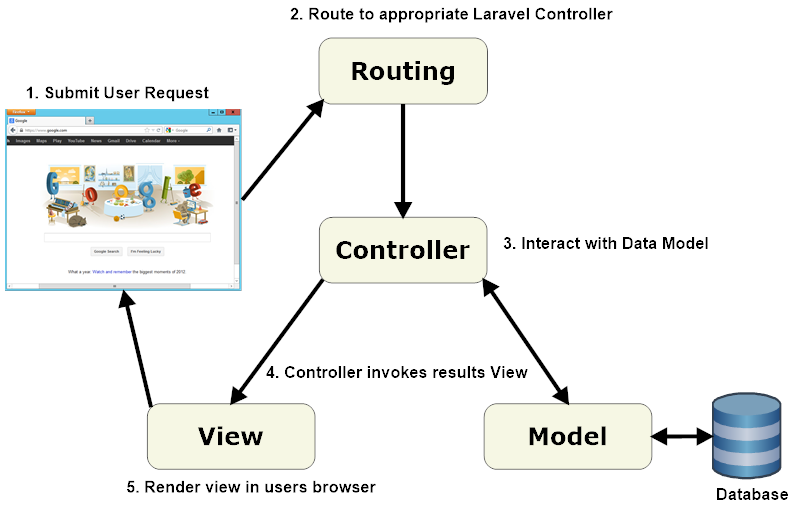

# what is MVC ?

  1. stand for model view and controller 
  2. MVC is an architectures support oops 
  3. MVC used to create secured app 
  4. MVC start to support in php5 , php 7 and php8
  5. MVC create an any type of  application in php
  6. MVC seprate logic in form of model view and controller 

# architectures of MVC 

   


  **Model**

    ```
    model created a database connection and also create a member function of our applications

    ```
    
  **view**

    ```
    view  created a UI part of our applications

    examples : form.php | contactus.php | index.php

    ``` 
        
  **controller**

    ```
    controller  created a logic in our  applications
    
    examples : if(isset($_POST["sub"]))
               {
                stored variables
               }

              set a routing of our applications
               
    ``` 