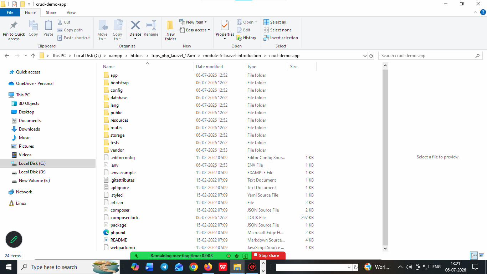

# what is Laravel and give some advantages of Laravel 

## What is Laravel?

Laravel is a free, open-source PHP web framework designed for building modern, scalable web applications. It follows the Model-View-Controller (MVC) architectural pattern and provides a comprehensive toolkit with built-in features for routing, authentication, database management, and more.

## Advantages of Laravel

1. **MVC Architecture** - Supports the Model-View-Controller pattern for organized and maintainable code structure

2. **Elegant Syntax** - Provides clean, readable, and expressive code that is easy to understand and maintain

3. **OOP Support** - Full support for Object-Oriented Programming concepts including classes, inheritance, polymorphism, and encapsulation

4. **Built-in Authentication** - Comes with pre-built authentication and authorization systems

5. **Eloquent ORM** - Provides an elegant Active Record implementation for database interactions

6. **Routing** - Simple and powerful routing mechanism for handling URL requests

7. **Middleware** - Built-in middleware support for filtering HTTP requests

8. **Blade Templating** - Powerful templating engine for creating dynamic views

9. **Database Migration** - Version control system for database schemas

10. **Artisan CLI** - Command-line interface for common development tasks

11. **Security** - Built-in protection against common web vulnerabilities (CSRF, SQL injection, etc.)

12. **Composer Integration** - Easy dependency management using Composer

13. **Testing** - Built-in testing utilities for unit and feature testing

14. **Community Support** - Large, active community with extensive documentation and packages


# how to install laravel ?

1. laravel 9.0.* version is used to install on php 8.1.2 version 
2. laravel 9 version support MVC architectures 
3. laravel support oops concepts to create any app
4. oops stands for object oriented structured language 
5. oops provides some features to support MVC architectures 

1. class
2. object 
3. inheritance 
4. polymorphism 
5. abstractions 
6. encapsulation 

# install laravel 9.0 via composer 

1. go inside of xampp => htdocs => create laravel app here
2. write a cmd command to create laravel app 
3. composer create-project laravel/laravel:9.0.* appname
4. cd appname  
5. php artisan serve

```  
INFO  Server running on [http://127.0.0.1:8000].
Press Ctrl+C to stop the server

```
6. put on maintenance mode 
php artisan down

7. put on live mode 
php artisan up    


# what is composer ? 

1. composer is an dependnecy manager it is help to install laravel app 
2. composer will download from   

https://getcomposer.org/download/

3. check composer install or not 

cmd: composer

4. composer details 

______
/ ____/___  ____ ___  ____  ____  ________  _____
/ /   / __ \/ __ `__ \/ __ \/ __ \/ ___/ _ \/ ___/
/ /___/ /_/ / / / / / / /_/ / /_/ (__  )  __/ /
\____/\____/_/ /_/ /_/ .___/\____/____/\___/_/
/_/
Composer version 2.10.1 2026-06-04 10:25:59


5. create a new laravel app via composer 

cmd : composer create-project laravel/laravel:9.0.* crud-demo-app

6. How to run laravel app 

cmd: cd crud-demo-app
cmd: php artisan serve

7. INFO  Server running on [http://127.0.0.1:8000].

Press Ctrl+C to stop the server        

8. How to put laravel app on maintannce mode 

cmd : php artisan down

php artisan down

INFO  Application is now in maintenance mode.  

9. How o put application on Live Mode 

cmd : php artisan up 
php artisan up
INFO  Application is now live.

10. php artisan serve

INFO  Server running on [http://127.0.0.1:8000].
Press Ctrl+C to stop the server


## Laravel Directory Structure Overview

Laravel follows a well-organized directory structure that separates concerns and promotes clean code architecture. Here's a detailed explanation of each folder:

### Root Level Directories

1. **app/** - Contains the core application code
- `Models/` - Database models (Eloquent ORM)
- `Controllers/` - Application controllers handling business logic
- `Middleware/` - HTTP middleware for request filtering
- `Providers/` - Service providers for application services
- `Exceptions/` - Exception handling classes

2. **bootstrap/** - Contains files for bootstrapping the application
- `app.php` - Application bootstrap file
- `cache/` - Cached framework files for optimization

3. **config/** - Application configuration files
- Database configuration
- Cache settings
- Mail settings
- Session configuration
- Authentication settings

4. **database/** - Database-related files
- `migrations/` - Database schema migrations (version control)
- `factories/` - Model factories for testing
- `seeders/` - Database seeders for initial data

5. **public/** - Web accessible directory (document root)
- `index.php` - Application entry point
- `css/` - Stylesheets
- `js/` - JavaScript files
- `images/` - Public images

6. **resources/** - Front-end resources and views
- `views/` - Blade template files for user interface
- `css/` - Source CSS files
- `js/` - Source JavaScript files
- `lang/` - Localization language files

7. **routes/** - Application route definitions
- `web.php` - Web routes for browser requests
- `api.php` - API routes for RESTful endpoints
- `console.php` - Console/Artisan commands
- `channels.php` - Broadcasting channel definitions

8. **storage/** - Application-generated files
- `app/` - Generated application files
- `logs/` - Application log files
- `framework/` - Framework-generated files (cache, sessions)

9. **tests/** - Test files for application testing
- `Unit/` - Unit tests
- `Feature/` - Feature tests

10. **vendor/** - Third-party packages installed via Composer
- Contains all dependencies and Laravel framework

### Important Root Files

- **.env** - Environment configuration file (database, API keys, etc.)
- **.gitignore** - Files to ignore in version control
- **composer.json** - Composer dependencies and project metadata
- **composer.lock** - Locked versions of dependencies
- **artisan** - Command-line interface for Laravel
- **package.json** - NPM dependencies for front-end tools



# php artisan command list .... 

about                  Display basic information about your application
clear-compiled         Remove the compiled class file
completion             Dump the shell completion script
db                     Start a new database CLI session
docs                   Access the Laravel documentation
down                   Put the application into maintenance / demo mode
env                    Display the current framework environment
help                   Display help for a command
inspire                Display an inspiring quote
list                   List commands
migrate                Run the database migrations
optimize               Cache the framework bootstrap files
serve                  Serve the application on the PHP development server
test                   Run the application tests
tinker                 Interact with your application
up                     Bring the application out of maintenance mode
auth
auth:clear-resets      Flush expired password reset tokens
cache
cache:clear            Flush the application cache
cache:forget           Remove an item from the cache
cache:table            Create a migration for the cache database table
config
config:cache           Create a cache file for faster configuration loading
config:clear           Remove the configuration cache file
db
db:monitor             Monitor the number of connections on the specified database
db:seed                Seed the database with records
db:show                Display information about the given database
db:table               Display information about the given database table
db:wipe                Drop all tables, views, and types
env
env:decrypt            Decrypt an environment file
env:encrypt            Encrypt an environment file
event
event:cache            Discover and cache the application's events and listeners
event:clear            Clear all cached events and listeners
event:generate         Generate the missing events and listeners based on registration
event:list             List the application's events and listeners
key
key:generate           Set the application key
make
make:cast              Create a new custom Eloquent cast class
make:channel           Create a new channel class
make:command           Create a new Artisan command
make:component         Create a new view component class
make:controller        Create a new controller class
make:event             Create a new event class
make:exception         Create a new custom exception class
make:factory           Create a new model factory
make:job               Create a new job class
make:listener          Create a new event listener class
make:mail              Create a new email class
make:middleware        Create a new middleware class
make:migration         Create a new migration file
make:model             Create a new Eloquent model class
make:notification      Create a new notification class
make:observer          Create a new observer class
make:policy            Create a new policy class
make:provider          Create a new service provider class
make:request           Create a new form request class
make:resource          Create a new resource
make:rule              Create a new validation rule
make:scope             Create a new scope class
make:seeder            Create a new seeder class
make:test              Create a new test class
migrate
migrate:fresh          Drop all tables and re-run all migrations
migrate:install        Create the migration repository
migrate:refresh        Reset and re-run all migrations
migrate:reset          Rollback all database migrations
migrate:rollback       Rollback the last database migration
migrate:status         Show the status of each migration
model
model:prune            Prune models that are no longer needed
model:show             Show information about an Eloquent model
notifications
notifications:table    Create a migration for the notifications table
optimize
optimize:clear         Remove the cached bootstrap files
package
package:discover       Rebuild the cached package manifest
queue
queue:batches-table    Create a migration for the batches database table
queue:clear            Delete all of the jobs from the specified queue
queue:failed           List all of the failed queue jobs
queue:failed-table     Create a migration for the failed queue jobs database table
queue:flush            Flush all of the failed queue jobs
queue:forget           Delete a failed queue job
queue:listen           Listen to a given queue
queue:monitor          Monitor the size of the specified queues
queue:prune-batches    Prune stale entries from the batches database
queue:prune-failed     Prune stale entries from the failed jobs table
queue:restart          Restart queue worker daemons after their current job
queue:retry            Retry a failed queue job
queue:retry-batch      Retry the failed jobs for a batch
queue:table            Create a migration for the queue jobs database table
queue:work             Start processing jobs on the queue as a daemon
route
route:cache            Create a route cache file for faster route registration
route:clear            Remove the route cache file
route:list             List all registered routes
sail
sail:add               Add a service to an existing Sail installation
sail:install           Install Laravel Sail's default Docker Compose file
sail:publish           Publish the Laravel Sail Docker files
sanctum
sanctum:prune-expired  Prune tokens expired for more than specified number of hours.
schedule
schedule:clear-cache   Delete the cached mutex files created by scheduler
schedule:list          List all scheduled tasks
schedule:run           Run the scheduled commands
schedule:test          Run a scheduled command
schedule:work          Start the schedule worker
schema
schema:dump            Dump the given database schema
session
session:table          Create a migration for the session database table
storage
storage:link           Create the symbolic links configured for the application
stub
stub:publish           Publish all stubs that are available for customization
vendor
vendor:publish         Publish any publishable assets from vendor packages
view
view:cache             Compile all of the application's Blade templates
view:clear             Clear all compiled view files

